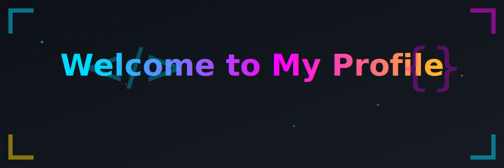

<div align="center">

<!-- Animated Header Banner -->
<table width="100%">
  <tr>
    <td align="center">
      
    </td>
  </tr>
</table>

<!-- Typing Effect Introduction -->
<table width="100%">
  <tr>
    <td align="center">
      
    </td>
  </tr>
</table>

<!-- Profile Views Counter -->
<table width="100%">
  <tr>
    <td align="center">
      
    </td>
  </tr>
</table>

<!-- Social Links -->
<table width="100%">
  <tr>
    <td align="center">
      <a href="https://www.linkedin.com/in/md-emran-79302b2b1/">
        
      </a>
      <a href="https://instagram.com/https.aatsan.ig">
        
      </a>
    </td>
  </tr>
</table>

</div>

---

## 🚀 About Me
> 💡 *"Code is poetry written in logic"*

```typescript
const emmraan = {
  role: "Full Stack Vibe Coder",
  location: "India 🇮🇳",
  timezone: "Asia/Kolkata (UTC+5:30)",
  availability: "Open to freelance & collaboration",
  
  currentFocus: [
    "Building scalable web applications",
    "Exploring AI/ML integration",
    "Cloud-native architecture",
    "Open source contributions"
  ],
  
  lifePhilosophy: "Code is poetry written in logic",
  
  funFact: "I can debug code faster than I can decide what to eat! 🍕"
};
```

I'm a passionate **Full Stack Vibe Coder** with expertise in building and maintaining complete web applications. I thrive on transforming complex problems into elegant, scalable solutions. My journey spans from crafting responsive frontends to architecting robust backend systems and deploying cloud-native applications.

🌟 **What drives me:** Creating technology that makes a difference, learning something new every day, and contributing to the developer community.

💡 **Currently exploring:** Advanced AI/ML integration, microservices architecture, and performance optimization techniques.

---

## 🛠️ Tech Stack

<summary><b>🎨 Frontend Development</b></summary>
<br>


<summary><b>⚙️ Backend Development</b></summary>
<br>


<summary><b>🗄️ Databases & Storage</b></summary>
<br>


<summary><b>☁️ Cloud & DevOps</b></summary>
<br>


<summary><b>🤖 AI/ML & Data Science</b></summary>
<br>


<summary><b>🛠️ Tools & Platforms</b></summary>
<br>


---

## 📊 GitHub Analytics

<div align="center">

<!-- Primary Metrics - Generated by Workflow (Most Reliable) -->
<table width="100%">
  <tr>
    <td align="center">
      <a href="https://github.com/Emmraan">
        
      </a>
    </td>
  </tr>
</table>

<!-- GitHub Stats & Streak - Using Reliable Alternative -->
<table width="100%">
  <tr>
    <td width="50%" align="center">
      <a href="https://github.com/Emmraan">
        
      </a>
    </td>
  </tr>
</table>

</div>

---

## 🐍 Contribution Graph

<div align="center">

<!-- Contribution Snake Animation -->
<table width="100%">
  <tr>
    <td align="center">
      <picture>
        <source media="(prefers-color-scheme: dark)" srcset="assets/gifs/github-contribution-grid-snake-dark.svg">
        <source media="(prefers-color-scheme: light)" srcset="assets/gifs/github-contribution-grid-snake-light.svg">
        
      </picture>
    </td>
  </tr>
</table>

</div>

---

## 📈 Contribution Distribution

<div align="center">

<table width="100%">
  <tr>
    <td align="center">
      <a href="https://github.com/Emmraan">
        
      </a>
    </td>
  </tr>
</table>

</div>

---

## ⚡ Recent Activity

<!--RECENT_ACTIVITY:start-->
1. ⬆️ Pushed undefined commit(s) to [Emmraan/Emmraan](https://github.com/Emmraan/Emmraan)<br>
2. ⬆️ Pushed undefined commit(s) to [Emmraan/Emmraan](https://github.com/Emmraan/Emmraan)<br>
3. ⭐ Starred [diegosouzapw/OmniRoute](https://github.com/diegosouzapw/OmniRoute)<br>
4. ⭐ Starred [decolua/9router](https://github.com/decolua/9router)<br>
5. ⭐ Starred [get-convex/convex-backend](https://github.com/get-convex/convex-backend)<br>

---

## 💬 Let's Connect

<div align="center">

**I'm always excited to collaborate on interesting projects!** Whether you have a groundbreaking idea, need a technical consultation, or just want to chat about the latest in tech, feel free to reach out.


<!-- 📧 **Email:** [Reach out via LinkedIn](https://www.linkedin.com/in/md-emran-79302b2b1/) -->

💼 **LinkedIn:** [Connect with me](https://www.linkedin.com/in/md-emran-79302b2b1/)

<!-- 🐦 **Twitter:** [Follow me](https://twitter.com/emmraan) -->

</div>

---

<div align="center">

<br>

<p align="center">
  
</p>

**⭐ Star some repositories if you find them interesting! ⭐**

</div>

---

<!-- Accessibility note: This README uses prefers-reduced-motion media queries for animations -->
<!-- Animated elements gracefully degrade to static versions when reduced motion is preferred -->
