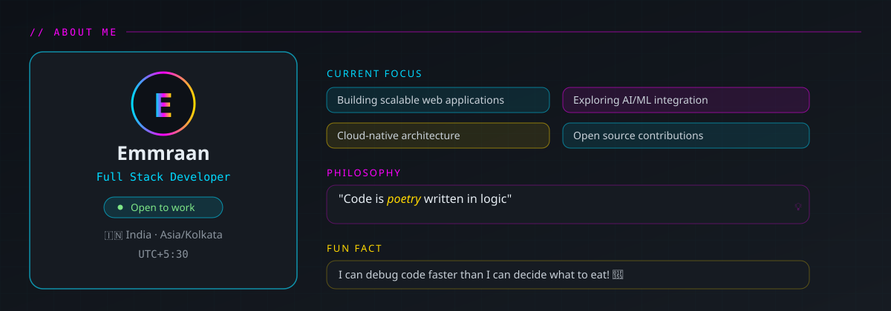
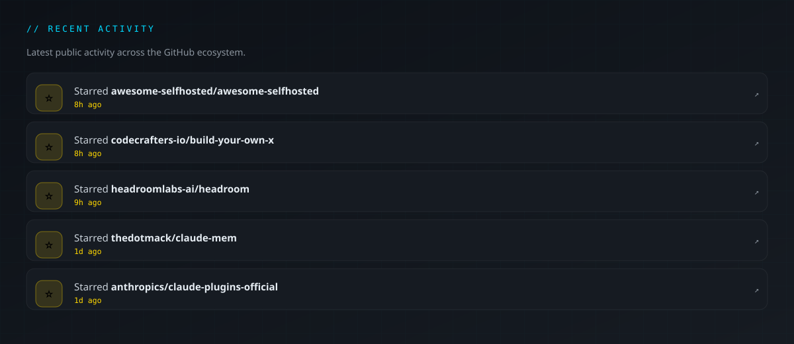
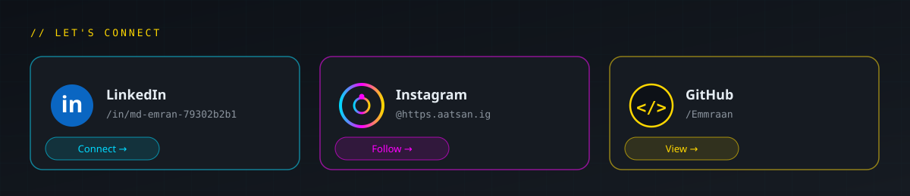
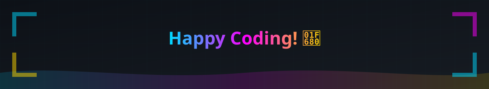

<!-- Animated Hero Banner -->
<table width="100%">
  <tr>
    <td align="center">
      
    </td>
  </tr>
</table>

<!-- Profile Views Counter -->
<table width="100%">
  <tr>
    <td align="center">
      
    </td>
  </tr>
</table>

---

## 🚀 About Me

> 💡 *"Code is poetry written in logic"*

  

 

I'm a passionate **Full Stack Vibe Coder** who thrives on transforming complex problems into elegant, scalable solutions — from responsive frontends to robust backends and cloud-native deployments.

---

## 🛠️ Tech Stack

  

---

## 📊 GitHub Analytics

<!-- Overview -->

 

<!-- Top Languages -->

 

<!-- Streak -->

---

## 🐍 Contribution Graph

<!-- Contribution Snake Animation -->
<table width="100%">
  <tr>
    <td align="center">
      <picture>
        <source media="(prefers-color-scheme: dark)" srcset="assets/gifs/github-contribution-grid-snake-dark.svg">
        <source media="(prefers-color-scheme: light)" srcset="assets/gifs/github-contribution-grid-snake-light.svg">
        
      </picture>
    </td>
  </tr>
</table>

---

## 📈 Contribution Distribution

---

## ⚡ Recent Activity

<!-- Generated by recent-activity.yml workflow -->

---

## 💬 Let's Connect

**I'm always excited to collaborate on interesting projects!** Whether you have a groundbreaking idea, need a technical consultation, or just want to chat about the latest in tech, feel free to reach out.

 

<!-- Social Cards -->

 

---

 

  

**⭐ Star some repositories if you find them interesting! ⭐**

---

<!-- Accessibility note: This README uses prefers-reduced-motion media queries for animations -->
<!-- Animated elements gracefully degrade to static versions when reduced motion is preferred -->
